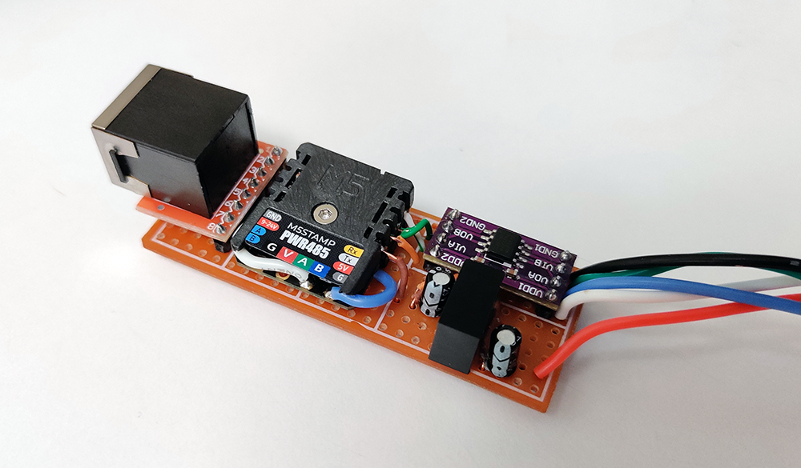
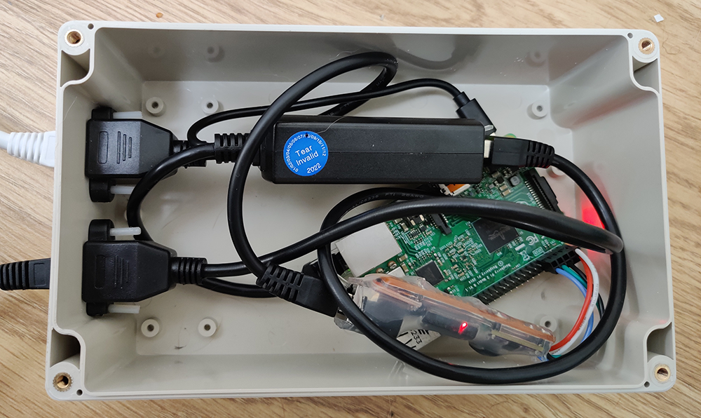
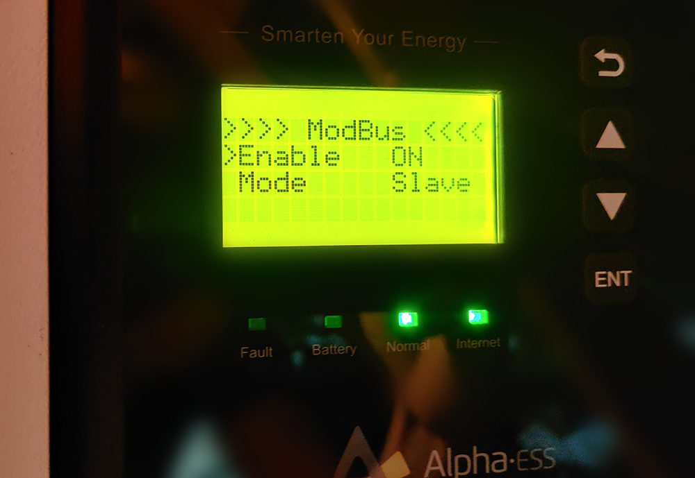
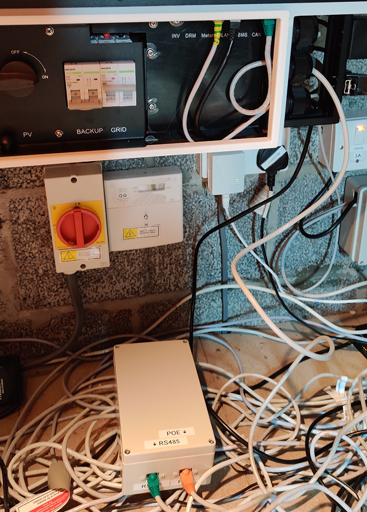

# AlphaESS ModBus reader

Async Python library to read ModBus from an AlphaESS inverter.

Compatible with:

| **Device**  | **Baud** | **Tested** |
|-------------|----------|------------|
| SMILE5      | 9600     | ✅          |
| SMILE-B3    | 9600     |            |
| SMILE-T10   | 9600     |            |
| Storion T30 | 19200    |            |

## Hardware

⚠️⚠️ This worked for me, so do at your own risk!! ⚠️⚠️

More information (and pictures) in the [Notes](#my-setup) section below.

- Use the inverter menu to enable modbus in slave mode.
- Snip one end of an ethernet cable off and connect (may vary):
    - Blue/white to RS485 A
    - Blue to RS485 B    
    - RS485 RX to GPIO 15
    - RS485 TX to GPIO 14
- Enable serial port on Raspberry Pi with `raspi-config`.
- Connect other end of ethernet cable to the inverter CAN port.

## Quick start

Clone repo and run `example.py`:

``` bash
git clone git@github.com:SorX14/alphaess_modbus.git
cd ./alphaess_modbus
./example.py
```

``` bash
[Sun, 20 Nov 2022 21:36:54] INFO [example.py.main:27] PV: 0W GRID: 1078W USE: 1078W Battery: 0W
```

Done! 🎉

## Architecture

Uses a JSON definition file containing all the ModBus registers and how to format them.

This library concentrates on reading data, but [writing](#writing-values) is possible.

For example, this definition entry:

``` json
  {
    "name": "pv2_current",
    "address": 1058,
    "hex": "0x0422",
    "type": "register",
    "signed": false,
    "decimals": 1,
    "units": "A"
  }
```

will read register `0x0422`, process the result as unsigned, divide it by 10, and optionally add `A` as the units.

The JSON file was created with [alphaess_pdf_parser](https://github.com/SorX14/alphaess_pdf_parser) reading from the [German AlphaESS register manual](https://www.alpha-ess.de/images/downloads/handbuecher/AlphaESS-Handbuch_SMILET30_ModBus_RTU_V123-DE.pdf).

## Reading values

### `Reader()`

Create a new reader

``` python
import asyncio
from alphamodbus.alphamodbus import Reader

async def main():
    reader: Reader = Reader(json_file="alphaess_registers.json", baud=9600)

    definition = await reader.get_definition("pv2_voltage")
    print(definition)

asyncio.run(main())
```

Set the location for the JSON definitions and your baud rate.

### `get_value(name)`

Requests a value from the inverter. Numeric result is returned.

``` python
grid = await reader.get_value("total_active_power_grid_meter")
print(grid)

# 1234
```

Prints the current grid usage as an integer.

### `get_units(name)`

Get units (if any) for a register name.

``` python
grid_units = await reader.get_units("total_active_power_grid_meter")
print(grid_units)

# W
```

### `get_formatted_value(name)`

Same as `get_value()` but returns a string with units.

``` python
grid = await reader.get_formatted_value("total_active_power_grid_meter")
print(grid)

# 1234W
```

### `get_definition(name)`

Get the JSON entry for an item. Useful if you're trying to [write](#writing-values) a register.

``` python
item = await reader.get_definition("inverter_power_total")
print(item)

# {'name': 'inverter_power_total', 'address': 1036, 'hex': '0x040C', 'type': 'long', 'signed': True, 'decimals': 0, 'units': 'W'}
```

## Writing values

☠️ ModBus gives full control of the inverter. There are device-level protections in place but be very careful ☠️

This library is intended to read values, but you can get a reference to the  [internal ModBus library](https://pypi.org/project/AsyncioMinimalModbus/) with `reader.instrument`:

``` python
read = await reader.instrument.read_long(int(0x0021), 3, False)
print(read)
```

Read the library docs for what to do next: https://minimalmodbus.readthedocs.io/en/stable/

Use the [AlphaESS manual](https://www.alpha-ess.de/images/downloads/handbuecher/AlphaESS-Handbuch_SMILET30_ModBus_RTU_V123-DE.pdf) for how each register works.

## Notes

### Definitions

While [my parsing script](https://github.com/SorX14/alphaess_pdf_parser) did its best, there are likely to be many faults and missing entries. I only need a few basic registers so haven't tested them all.

PR's are welcome 🙂

### Speed

The ModBus interface only runs at 9600 so you can query about 6 parameters a second (depending on register length). A standard request for total usage needs three requests, so you can get ~2 req/s.

### Error handling

I've had the connection break a few times while testing, make sure you handle reconnecting correctly. `example.py` will output the full exception should one happen.

### My setup

I used a [m5stamp RS485 module](https://shop.m5stack.com/products/m5stamp-rs485-module) with a digital isolator and DC/DC isolator.



Installed in an enclosure with a PoE adapter to power the Pi and provide connectivity.



Enabled ModBus interface on the inverter. You'll need the service password, mine was set to the default of `1111`.



Then connected to the CAN port.



# Credit and thanks

Special thanks go to https://github.com/CharlesGillanders/alphaess where I originally started
playing around with my PV system. Their project uses the AlphaESS dashboard backend API to unofficially get inverter values from the cloud.

Invaluable resource for discussing with other users. Highly
recommend reading https://github.com/CharlesGillanders/alphaess/issues/9 which ended up with
AlphaESS creating an official API to retrieve data - https://github.com/alphaess-developer/alphacloud_open_api

Another great resource is https://github.com/dxoverdy/Alpha2MQTT which uses a ESP8266 instead
of a Raspberry PI to communicate with the inverter - again - highly recommended.